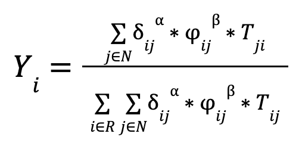
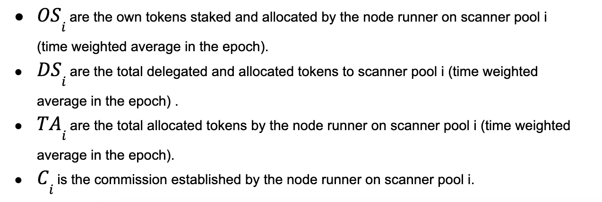

# Delegated Staking Rewards

## Claiming rewards

After the end of each epoch (**Monday 00:00:00 UTC**), reward calculation starts. The rewards are written to the rewards distributor contract as soon as the calculation is completed. When the rewards are avaialble in the contract, pool owners and delegators can claim their portion of the rewards.

!!! important "Forta App"
    Forta App will soon have a feature to view and claim your rewards. Meanwhile, you can use Polygonscan to do this.

To claim pool owner rewards over Polygonscan:

- visit the [`getCurrentEpochNumber`](https://polygonscan.com/address/0xf7239f26b79145297737166b0c66f4919af9c507#readProxyContract#F7) and take a note of the epoch number,
- visit the [`claimRewards`](https://polygonscan.com/address/0xf7239f26b79145297737166b0c66f4919af9c507#writeProxyContract#F1) method
- click on "Connect to Web3" on the top and connect your wallet,
- and fill in:
    - **subjectType:** 2
    - **subjectId:** Your pool ID
    - **epochNumbers:** Do number from first step minus 1 and input e.g. `[2561]` if the number was 2562
- click on "Write" to send the transaction.

## Formula

With the introduction of delegated staking, there are new reward formulas for pool owners and delegators. These formulas seek to

- encourage node runners to ensure the reliability and performance of the Forta network by achieving the highest possible SLA scores in their nodes,
- encourage node runners and delegators to stake more and increase the economic security of the network.

The approach involves distributing rewards to participants as a function of the proportional scan node SLA, scan node uptime and allocated pool stake on the network, using the Cobb-Douglas production function.

!!! important "Important definitions"
    - **epoch duration**: 1 week, from Monday 00:00:00 UTC to Sunday 23:59:59 UTC
    - **commission becomes effective**: next epoch
    - **commission lockdown after any change**: two epochs (excluding the current one)

    These values subject to change.

The score of scan node `j` during an epoch is:

Consequently, the total score of scanner pool `i` during an epoch is:

And the share of the rewards scanner pool `i` receives during an epoch is:

Consequently, the total amount of rewards allocated to scanner pool `i`, during an epoch is:

where `F` is the total amount of FORT rewards to all of the Forta scan nodes during the epoch.

Finally, the total amount of rewards allocated to scanner pool `i` is divided between the node runner of that pool and all the delegators to it:

Node runner rewards on scanner pool `i`: 

Delegator rewards on scanner pool `i`:
 

The values of parameters α and β are set to 3 and 0.5 respectively and are subject to change in the future.

The total amount of the delegator rewards are distributed to each delegator proportionally to their deposited stake. The on-chain rules are the ultimate authority of this logic, and in the case where the on-chain rules differ from this, it will prevail.
